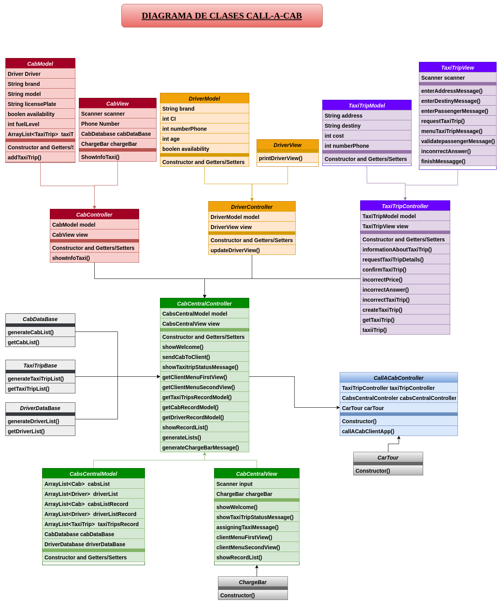
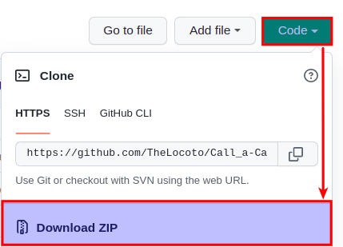

# Call a Cab Project

## Name
Call a Cab

## Description

#### Objective:
This application call a taxi when you need it.

#### Functionality:
- First, it asks for your data.
- Show the data you entered, to confirm that they are correct.
- Search for available taxis and drivers.
- If they are available, show the information of the taxi and driver, 
  to confirm if you agree to assign this taxi and driver.
- If they are not available, it will ask you if you want to search 
  again.
- If you agree, the driver is assigned to the taxi and the taxi is 
  assigned to you.
- If you do not agree, I will look for a taxi and driver to ask you 
  again.

## Visuals
You can see our 
<a href="https://drive.google.com/file/d/1lz21Upk-FKNNfwfy6xHk5AK-ZOPPJ8_7/view" target="_blank">
class diagram</a>.


## Instalation

#### Requirements:
 - <a href="https://www.oracle.com/java/technologies/javase/jdk11-archive-downloads.html" target="_blank">
   Java</a> version 11.
 - <a href="https://git-scm.com/downloads" target="_blank">
   Git</a> version 2.35.1 (optional)
 - Code editor, like 
   <a href="https://www.jetbrains.com/idea/download/#section=linux" target="_blank">
   intellij idea</a>.

#### Installation guide:
You can get our project in two options:
 - First option, you can clone our project from our
   <a href="https://github.com/TheLocoto/Call_a-Cab" target="_blank">
   main repository</a>,
   using git from the command line.
 - This project will be cloned into the directory where the terminal 
   is located. 
 ```git
 git clone https://github.com/TheLocoto/Call_a-Cab
 ```
 - Second option, you can download our project for out
   <a href="https://github.com/TheLocoto/Call_a-Cab" target="_blank">
   main repository</a>.
   

## Usage
Example of the method that asks for your data.
This method is found in the TaxiTripController class inside the 
Controller package.
```java
import Model.TaxiTrip;
import View.TaxiTripView;

public class TaxiTripController(){
    
    public void requestTaxiTrip(){
        view.taxiTripRequestMessage();
        
        String address = view.enterAddressMessage();
        setTaxiTripAddress(address);
        
        String destiny = view.enterDestinyMessage();
        setTaxiTripDestiny(destiny);
        
        int passengers = view.enterPassengersMessage();
        
        while (passengers > 5) {
            view.validatePassengersMessage();
            passengers = view.enterPassengersMessage();
        }
        
        setTaxiTripPassengers(passengers);
    }
    
}
```
## Extra Feauters
- We add a Utils package, so that the console messages are more aesthetic.
  Inside this package are the classes:
    - CarTour, represents a simulation of the taxi route.
    - ChargeBar, is responsible for printing a load bar.
    - Color, they are colors that we will use in the messages of the classes of the View package.
- We add the DataBase package, we find a database simulation using tables.
  Inside this package are the classes:
    - CabDataBase, DriverDataBase, taxiTripDataBase.
      In these classes we create objects, then store them in a list and then return it with a getter method.

## Roadmap
- We want to add various types of cars, like as party limousines,
  moving trucks, etc. Using the Open/Close principle of SOLID.

## Authors
 - [Diego Hernan Figueroa Sevillano](https://github.com/TheLocoto)
 - [Luiggy Mamani Condori](https://github.com/luiggy2620)
 - [Juan Pablo David Arequipa Paniagua](https://github.com/JPDArequipaP)
 - [Eduard Jhon Herrera Sanchez](https://github.com/EduardJhonnHerreraSanchez)


